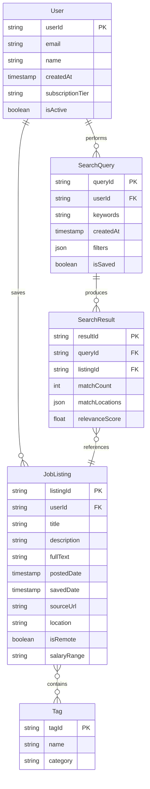

# Tributary - JobSearch Analytics Platform

## Entity Relationship Diagram

## Entity Descriptions

### User
Stores user account information, authentication details, and subscription status. This entity tracks who is using the platform and what level of service they have access to.

### JobListing
Contains complete job listings saved by users, including the full text for keyword analysis. This is the core data that users collect and later analyze for trends and patterns.

### Company
Information about companies that posted the job listings. Enables filtering and analysis by company characteristics.

### Tag
Keywords, skills, technologies, and other metadata extracted from job listings. These may be automatically extracted or manually added, and enhance searchability.

### SearchQuery
Records of keyword searches performed by users, including search parameters and filters. Preserves search history and enables repeated or refined searches.

### SearchResult
Results of keyword searches, showing which job listings matched and their relevance. Stores detailed information about matches to support aggregated reporting.

### Report
Saved analytics reports and visualizations generated by users from search results. Enables users to save findings and track trends over time.
