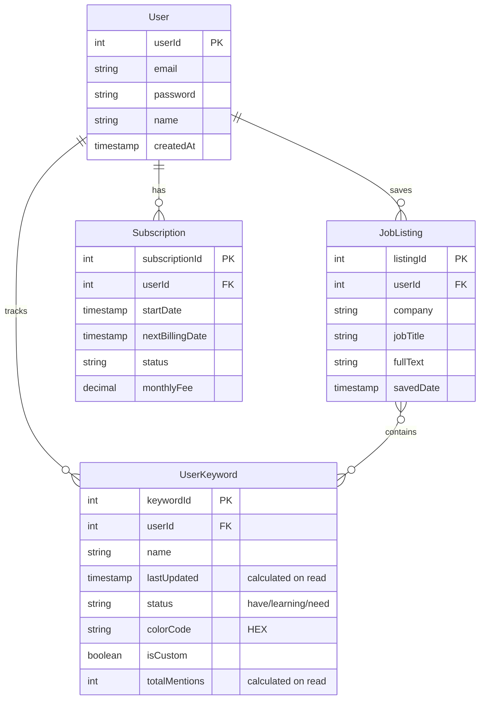

## Entity Relationship Diagram

## Entity Descriptions

### User
Stores user account information and authentication details. This entity tracks who is using the platform and is the central entity that relates to job listings, keywords, and subscription data. The password field stores the hashed user password for authentication.

### Subscription
Contains details about a user's subscription, including billing dates and payment status. This supports the subscription management shown in the wireframe ("Premium (£1.99/month)", "Next billing: 15/06/2023"). This aligns with the user story "As a user, I need to subscribe for '£1.99 a month' to use the service via stripe."

### JobListing
Contains job listings saved by users, including company name, job title, and the full text for keyword analysis. This supports the user story "As a user, I want to be able to save job listings to my account so that I can view them later" and "As a user I want to be able to view a list of all my saved job listings, sorted by date saved with the recommended structure of 'Company Name (Job Title) - Date Saved'."

For the MVP, we're focusing only on essential fields needed to display and analyze job listings.

### UserKeyword
Tracks keywords that users are monitoring, along with their status (have, learning, need to learn) and associated color coding. This supports the keyword tracker feature in the wireframe with the color indicators (🟢, 🟡, 🔴). This aligns with the user story "As a user, I want to be able to colour code my keywords so I can identify skills I have vs skills I am acquiring" and "As a user, I want to be able to delete unwanted keywords as an overriding function if I want to."

The `totalMentions` field is calculated on read by counting the number of job listings containing the keyword, rather than being stored permanently, which improves efficiency and ensures data consistency.

## Relationship Explanations

- **User-JobListing**: A user can save many job listings, but each job listing belongs to one user.
- **User-UserKeyword**: A user can track many keywords, but each tracked keyword belongs to one user.
- **User-Subscription**: A user can have one subscription record, with history managed through timestamps.
- **JobListing-UserKeyword**: 
  - A job listing can have many different keywords, provided they are already custom-tracked by the user as a UserKeyword, 
  - with a maximum count value of 1 for the keyword e.g. 1 job listing with 5 mentions of "python" will only count as 1 mention of "python", 5 job listings with 1 mention of "python" will count as 5 mentions of "python"...

## Efficiency Considerations

This model has been optimized for efficiency based on the assumption that users only track keywords in their own job listings:

1. **Reduced Storage**: Removed non-essential fields for MVP, focusing only on what's needed for core functionality.

2. **Simplified Queries**: Eliminated the keywordCounts JSON field since keyword presence is binary (exists/doesn't exist) for counting purposes.

3. **Lower Compute Costs**: The simpler database structure requires less computational resources for queries.

4. **Consistent Data**: Calculating totalMentions on read ensures it's always up-to-date with the latest job listings.

This simplified model supports the MVP requirements shown in the wireframe and described in user stories while optimizing for cost and computational efficiency.
