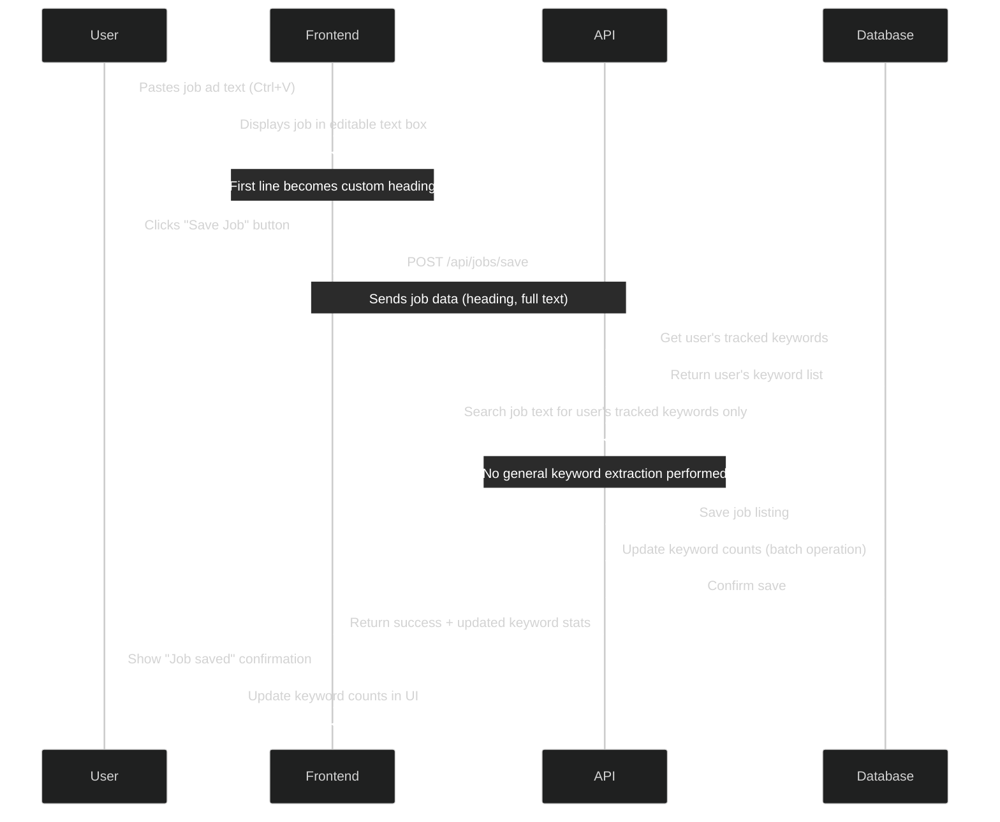

# Network Calls and Data Flow

This document outlines the network calls and data flow for key user actions in the Tributary application. The diagrams focus on optimizing for cost efficiency while maintaining necessary functionality.

## User Saves a Job Listing



### Cost Optimization Strategies

1. **Selective Keyword Processing**:
   - Only extract and process keywords the user is already tracking
   - No processing of new potential keywords until user explicitly adds them

2. **Batch Database Operations**:
   - Update keyword counts in a single database transaction
   - Avoid multiple separate database calls

3. **Minimal Data Transfer**:
   - Send only essential job data in the initial save request
   - Return only updated keyword stats, not the entire job listing

4. **Caching**:
   - Cache frequently accessed user keyword lists
   - Cache job listing check results to prevent redundant database queries

5. **Lazy Loading**:
   - Only calculate totalMentions when specifically requested
   - Defer heavy computations until needed

### Data Payload Example

```json
// POST /api/jobs/save request
{
  "heading": "Senior Developer at Acme Inc",
  "fullText": "Job description text...",
}

// Success response
{
  "success": true,
  "listingId": 456,
  "keywordStats": [
    { "keyword": "JavaScript", "newCount": 12, "status": "have" },
    { "keyword": "React", "newCount": 8, "status": "learning" }
  ]
}
```

## Additional Data Flows

*More data flows for other user actions will be added here...* 