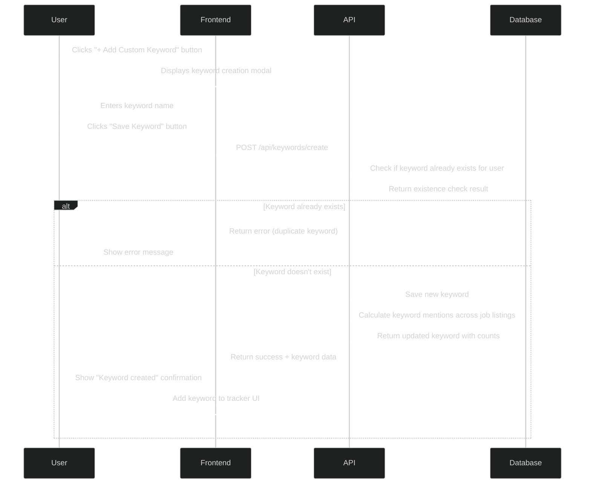
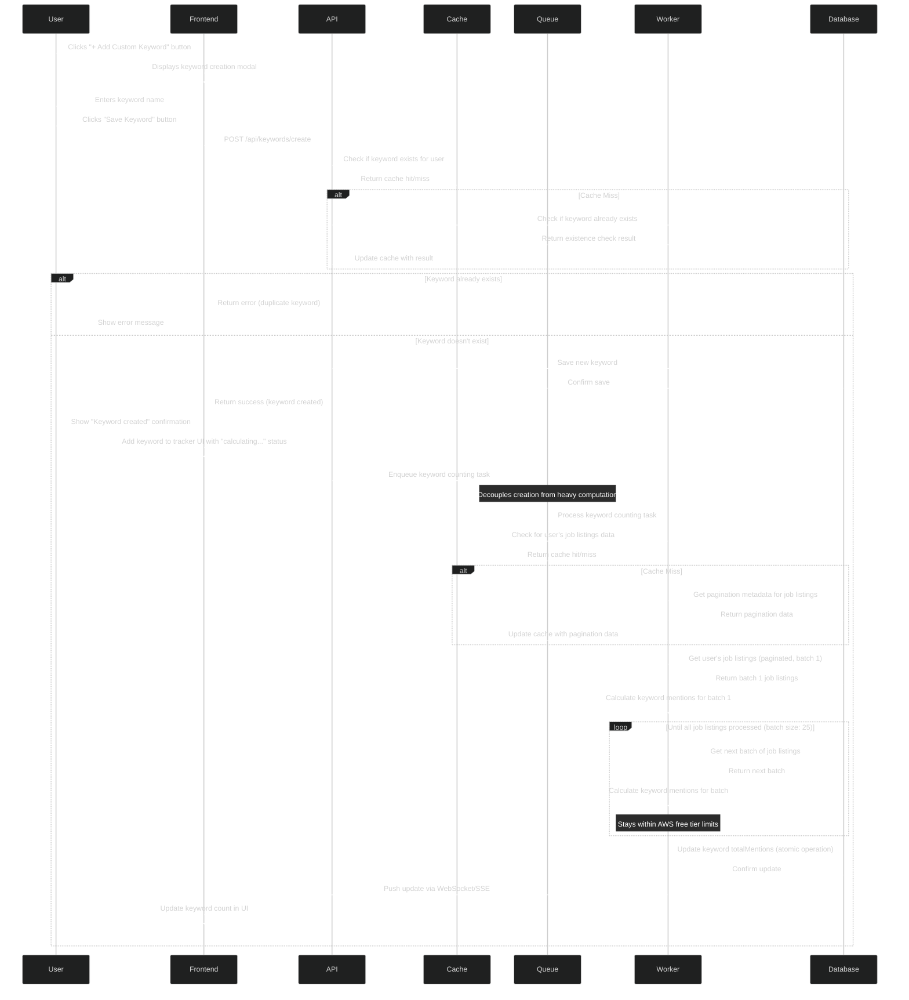

# Create Keyword

This document outlines the network calls and data flow for creating a keyword in the Tributary application.

## Overview Diagram



## Detailed Implementation Diagram



## Data Payload Examples

```json
// POST /api/keywords/create request
{
  "name": "TypeScript"
}

// Initial success response (immediate)
{
  "success": true,
  "keyword": {
    "keywordId": 123,
    "name": "TypeScript",
    "isCustom": true,
    "totalMentions": "calculating..."
  }
}

// WebSocket/SSE update (async)
{
  "type": "KEYWORD_COUNT_UPDATED",
  "keywordId": 123,
  "totalMentions": 3
}
```

## AWS Free Tier & Cost Optimizations

The detailed implementation diagram incorporates several optimizations to ensure the application stays within AWS free tier limits and minimizes costs:

1. **Caching Layer**:
   - Uses ElastiCache (Redis) to cache keyword existence checks
   - Reduces database reads for frequently accessed data
   - AWS Free Tier: 750 hours of t2.micro Redis node per month

2. **Asynchronous Processing**:
   - Moves heavy computation to background workers via SQS
   - Prevents API timeouts for users with many job listings
   - AWS Free Tier: 1 million SQS requests per month

3. **Batch Processing & Pagination**:
   - Retrieves job listings in smaller batches (e.g., 25 at a time)
   - Stays under DynamoDB read capacity unit limits
   - AWS Free Tier: 25 read/write capacity units for DynamoDB

4. **Progressive Loading Pattern**:
   - Returns immediate response to user without waiting for counts
   - Uses WebSockets or Server-Sent Events for real-time updates
   - Improves perceived performance while reducing costs

5. **Database Optimization**:
   - Uses atomic counter updates instead of full record updates
   - Minimizes write capacity units consumed
   - Reduces the risk of write conflicts

## Resilience Improvements

The detailed implementation also includes several resilience enhancements:

1. **Fault Isolation**:
   - Separates keyword creation from count calculation
   - Ensures basic functionality works even if counting fails

2. **Retry Mechanisms**:
   - Queue-based processing enables automatic retries for failed operations
   - Can configure Dead Letter Queues for operations that fail repeatedly

3. **Cache Fallbacks**:
   - System degrades gracefully by falling back to database if cache fails
   - Cache misses automatically populate the cache for future requests

4. **Real-time Updates**:
   - WebSocket/SSE connection provides real-time feedback
   - Users don't need to refresh to see updated counts 