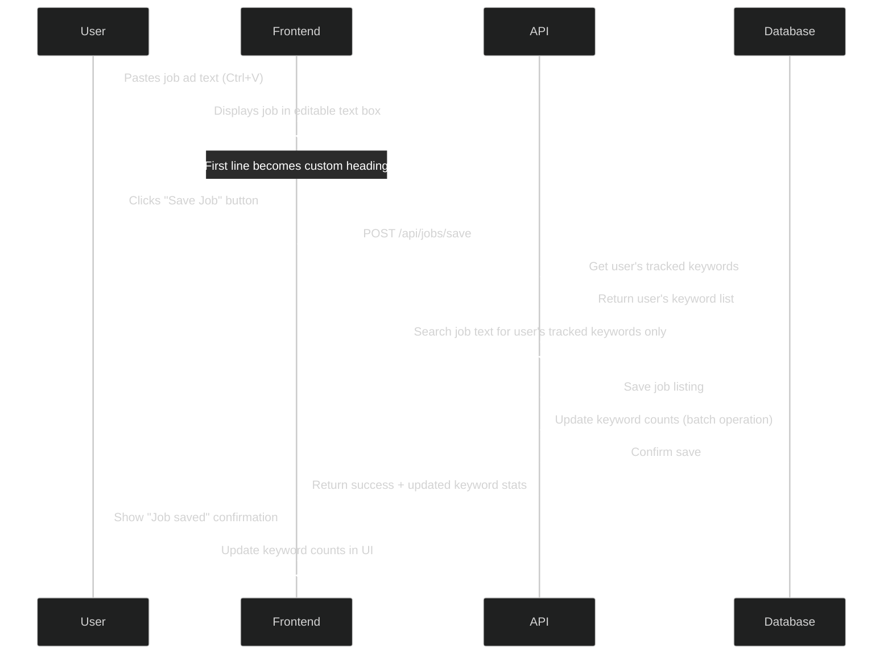
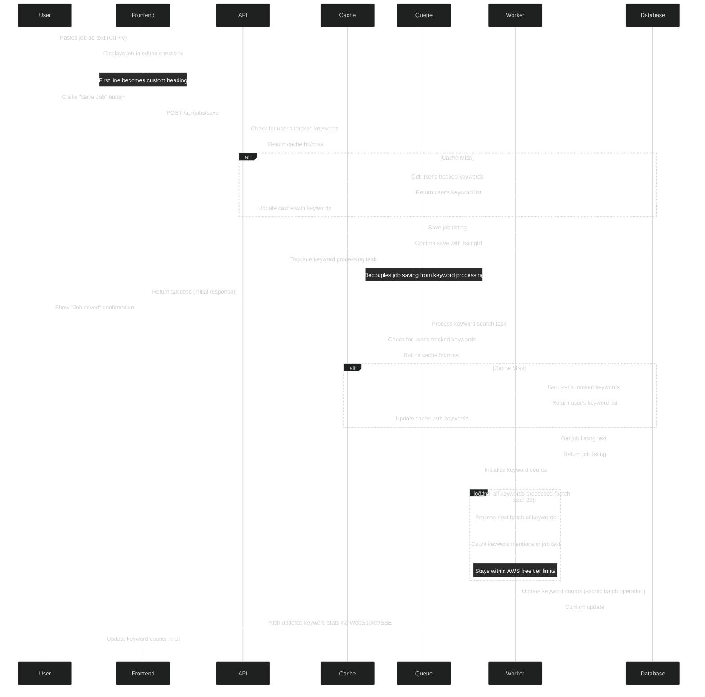

# Save Job Listing

This document outlines the network calls and data flow for saving a job listing in the Tributary application.

## Overview Diagram



## Detailed Implementation Diagram



## Data Payload Example

```json
// POST /api/jobs/save request
{
  "heading": "Senior Developer at Acme Inc",
  "fullText": "At Acme Inc, we are looking for a Senior Developer with 5 years of experience in..."
}

// Initial success response (immediate)
{
  "success": true,
  "listingId": 456,
  "message": "Job listing saved, processing keywords..."
}

// WebSocket/SSE update (async)
{
  "type": "KEYWORD_COUNT_UPDATED",
  "listingId": 456,
  "keywordStats": [
    { "keyword": "JavaScript", "newCount": 12 },
    { "keyword": "React", "newCount": 8 },
    { "keyword": "Python", "newCount": 5 },
    { "keyword": "SQL", "newCount": 3 },
    { "keyword": "AWS", "newCount": 2 }
  ]
}
```

## AWS Free Tier & Cost Optimizations

The detailed implementation diagram incorporates several optimizations to ensure the application stays within AWS free tier limits and minimizes costs:

1. **Caching Layer**:
   - Uses ElastiCache (Redis) to cache user's keyword lists
   - Reduces repeated database reads for the same user
   - AWS Free Tier: 750 hours of t2.micro Redis node per month

2. **Asynchronous Processing**:
   - Moves keyword processing to background workers via SQS
   - Prevents API timeouts for large job listings or many keywords
   - AWS Free Tier: 1 million SQS requests per month

3. **Progressive Response Pattern**:
   - Returns immediate confirmation of job save without waiting for keyword processing
   - Uses WebSockets or Server-Sent Events for pushing keyword stats updates
   - Improves perceived performance and user experience

4. **Database Optimization**:
   - Uses atomic batch updates for keyword counts
   - Minimizes the number of write operations to the database
   - Stays within DynamoDB write capacity unit limits (AWS Free Tier: 25 WCUs)

## Resilience Improvements

The detailed implementation also includes several resilience enhancements:

1. **Fault Isolation**:
   - Separates job saving from keyword processing
   - Ensures jobs are saved even if keyword processing fails

2. **Retry Mechanisms**:
   - Queue-based processing enables automatic retries for failed operations
   - Can configure Dead Letter Queues for operations that fail repeatedly

3. **Cache Fallbacks**:
   - System degrades gracefully by falling back to database if cache fails
   - Cache misses automatically populate the cache for future requests

4. **Real-time Updates**:
   - WebSocket/SSE connection provides real-time feedback
   - Updates UI as soon as keyword processing completes 