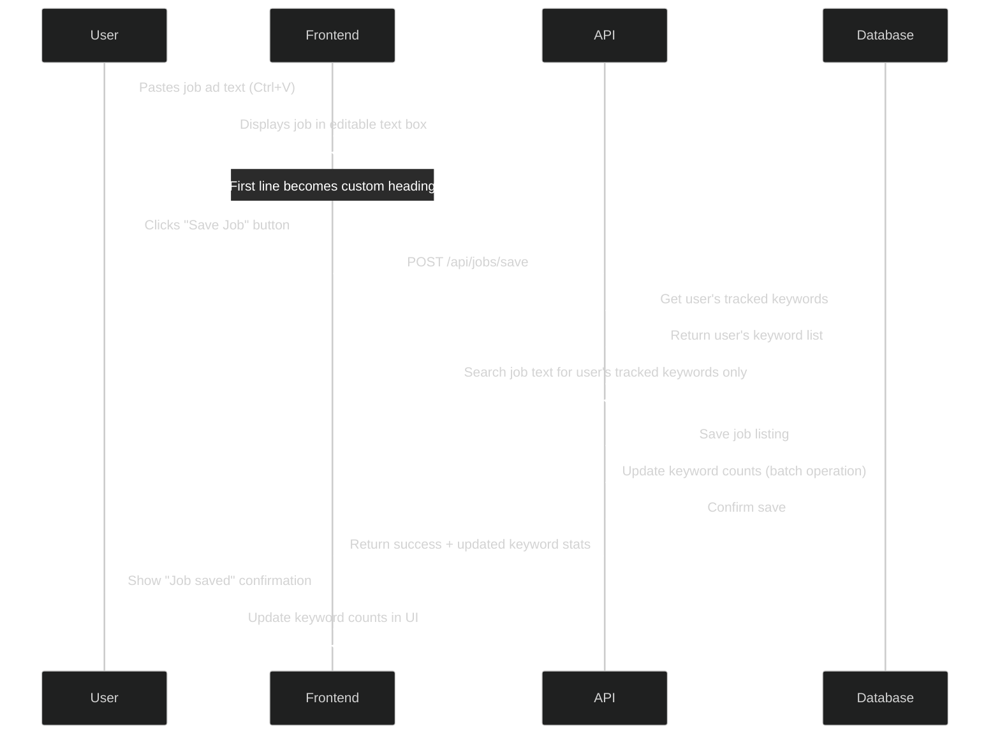
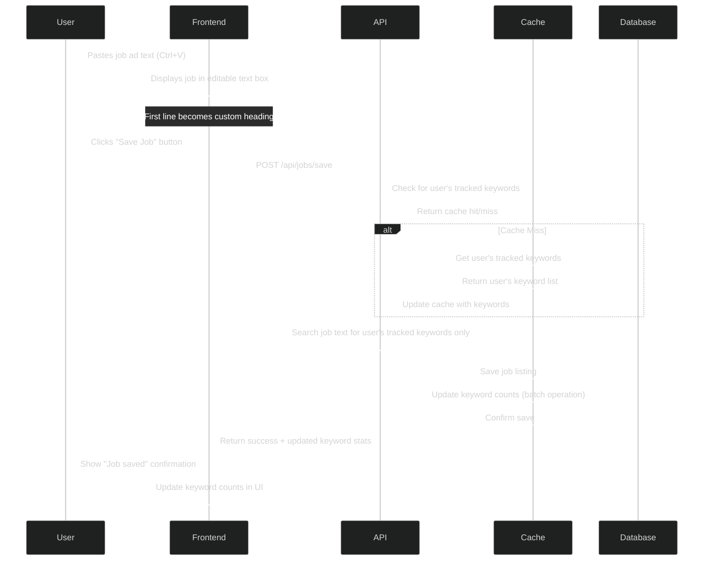

# Save Job Listing

This document outlines the network calls and data flow for saving a job listing in the Tributary application.

## Overview Diagram



## Detailed Implementation Diagram



## Data Payload Example

```json
// POST /api/jobs/save request
{
  "heading": "Senior Developer at Acme Inc",
  "fullText": "At Acme Inc, we are looking for a Senior Developer with 5 years of experience in..."
}

// Success response
{
  "success": true,
  "listingId": 456,
  "keywordStats": [
    { "keyword": "JavaScript", "newCount": 12, "status": "have" },
    { "keyword": "React", "newCount": 8, "status": "learning" },
    { "keyword": "Python", "newCount": 5, "status": "need" },
    { "keyword": "SQL", "newCount": 3, "status": "have" },
    { "keyword": "AWS", "newCount": 2, "status": "learning" }
  ]
}
``` 