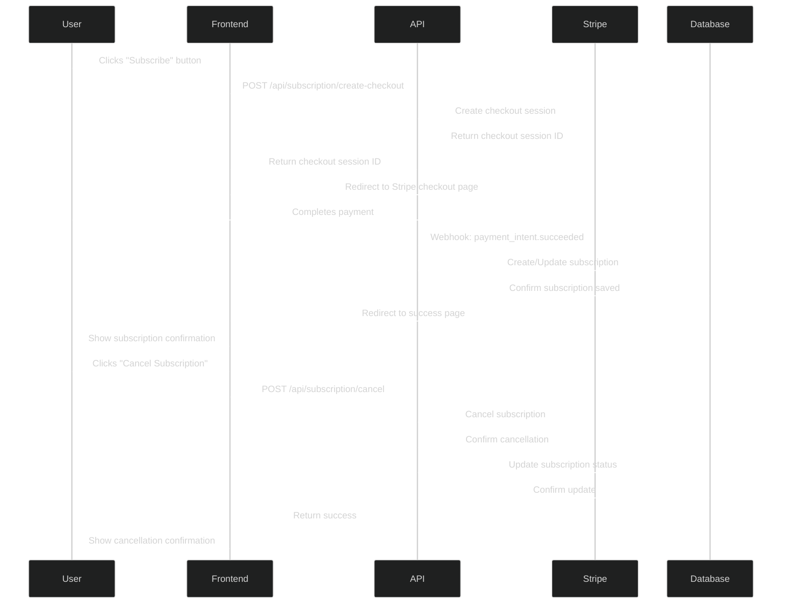
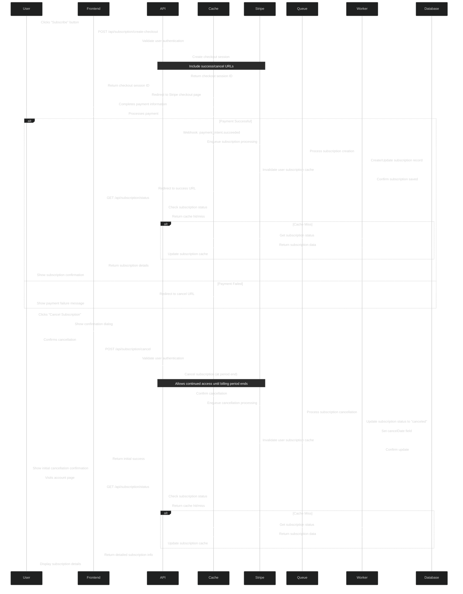

# Subscription Management

This document outlines the network calls and data flow for managing subscriptions in the Tributary application.

## Overview Diagram



## Detailed Implementation Diagram



## Data Payload Examples

```json
// POST /api/subscription/create-checkout request
{
  "priceId": "price_1AbCdEfGhIjKlMnOpQrStUvW",
  "successUrl": "https://tributary.app/subscription/success",
  "cancelUrl": "https://tributary.app/subscription/cancel"
}

// POST /api/subscription/create-checkout response
{
  "success": true,
  "checkoutSessionId": "cs_test_a1b2c3d4e5f6g7h8i9j0",
  "checkoutUrl": "https://checkout.stripe.com/c/pay/cs_test_a1b2c3d4e5f6g7h8i9j0"
}

// Stripe webhook event: payment_intent.succeeded
{
  "id": "evt_1AbCdEfGhIjKlMnOpQrStUvW",
  "object": "event",
  "type": "payment_intent.succeeded",
  "data": {
    "object": {
      "id": "pi_1AbCdEfGhIjKlMnOpQrStUvW",
      "customer": "cus_1AbCdEfGhIjKlMnOpQrSt",
      "amount": 199,
      "currency": "gbp",
      "status": "succeeded"
    }
  }
}

// POST /api/subscription/cancel request
{
  "cancelImmediately": false
}

// POST /api/subscription/cancel response
{
  "success": true,
  "message": "Subscription will be canceled at the end of the current billing period",
  "effectiveDate": "2023-06-15T00:00:00Z"
}

// GET /api/subscription/status response
{
  "success": true,
  "subscription": {
    "status": "active", // or "canceled", "past_due", etc.
    "currentPeriodStart": "2023-05-15T00:00:00Z",
    "currentPeriodEnd": "2023-06-15T00:00:00Z",
    "cancelAtPeriodEnd": false,
    "plan": {
      "name": "Premium",
      "amount": 199,
      "currency": "gbp",
      "interval": "month"
    }
  }
}
```

## AWS Free Tier & Cost Optimizations

The subscription management implementation incorporates several optimizations to ensure the application stays within AWS free tier limits:

1. **Caching Layer**:
   - Uses ElastiCache (Redis) to cache subscription status
   - Reduces repeated database reads
   - AWS Free Tier: 750 hours of t2.micro Redis node per month

2. **Asynchronous Processing**:
   - Processes subscription events via background workers
   - Ensures system remains responsive
   - AWS Free Tier: 1 million SQS requests per month

3. **Webhook Management**:
   - Uses API Gateway for Stripe webhook endpoints
   - AWS Free Tier: 1 million API calls per month

4. **Database Optimization**:
   - Minimal subscription data stored in database
   - Leverages Stripe for payment history details
   - Stays within DynamoDB read/write capacity unit limits

## Resilience Improvements

The implementation includes several resilience features:

1. **Idempotent Processing**:
   - Webhook handlers are idempotent to prevent duplicate processing
   - Using Stripe's idempotency keys for payment operations

2. **Graceful Degradation**:
   - System falls back to database if cache is unavailable
   - Frontend displays appropriate messages during service disruptions

3. **Retry Mechanisms**:
   - Queue-based processing enables automatic retries for failed operations
   - Configured Dead Letter Queues for handling persistent failures

4. **Error Recovery**:
   - Subscription state can be manually reconciled through admin tools
   - Regular audits compare Stripe subscription state with database
``` 